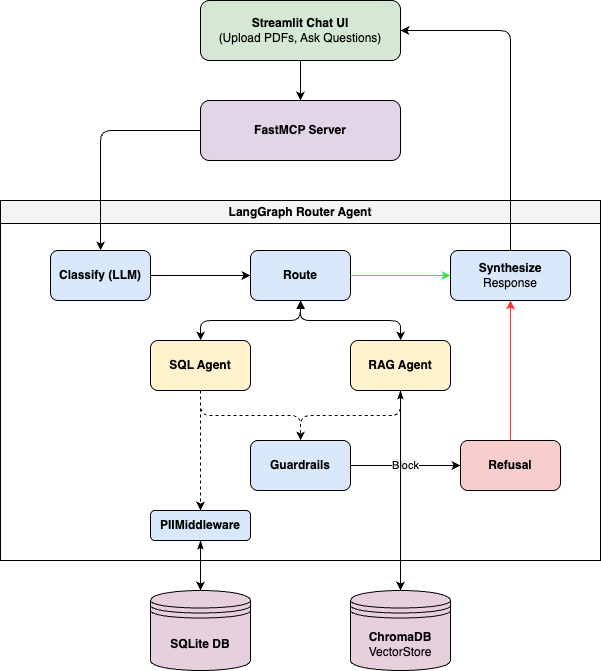

# 🤖 GenAI Multi-Agent Customer Support System

A **Generative AI–powered Multi-Agent System** that enables customer support executives to interact with both structured database data and unstructured policy documents using natural language.

Built with **LangChain**, **LangGraph**, and **Streamlit** with flexible support for **Google Gemini**, **OpenAI**, **Anthropic**, and local LLMs (via **LM Studio**).

## 🎥 Demo Video

<iframe width="560" height="315" src="https://www.youtube.com/embed/rwBjXW65ONw?si=_kyTV9UyrQMA7hq4" title="YouTube video player" frameborder="0" allow="accelerometer; autoplay; clipboard-write; encrypted-media; gyroscope; picture-in-picture; web-share" referrerpolicy="strict-origin-when-cross-origin" allowfullscreen></iframe>

[Click here to watch the demo video showcasing the functionality](https://youtu.be/rwBjXW65ONw)

---

## 🏗️ Architecture




### Agent Roles

| Agent | Purpose | Data Source |
|-------|---------|-------------|
| **Router** | Classifies queries and routes to specialist agents | LLM (Configurable) |
| **SQL Agent** | Queries structured customer data via natural language | SQLite database |
| **RAG Agent** | Searches uploaded policy documents | ChromaDB vector store |

---

## 🔒 Security Architecture

The GenAI Customer Assistant implements a multi-layered security architecture designed to prevent prompt injection, data exfiltration, and unauthorized actions. This is achieved using **LangChain Middleware** to establish firm execution guardrails.

1.  **Middleware Intent Classification (`@before_agent`)**:
    *   Before the `sql_agent` or `rag_agent` process any request, a custom `@before_agent` hook evaluates the user's intent.
    *   If malicious intent is detected (e.g., prompt injection, requests to bypass rules, requests to drop tables), the middleware intercepts the execution, skips the LLM tool call entirely, and immediately returns a safe refusal template.
2.  **Tool-Level SQL Execution Guardrails**:
    *   Raw SQL execution via the LLM is wrapped in a custom validation function.
    *   Checks are performed *before* database execution to block `SELECT *`, ensure a `LIMIT` clause is present, and entirely prohibit DML (Data Manipulation Language) statements like `INSERT`, `UPDATE`, `DELETE`, and `DROP`.
3.  **PII Middleware Sanitization (`PIIMiddleware`)**:
    *   Even if a query legitimately retrieves data, the output is passed through LangChain's built-in `PIIMiddleware` before returning to the LLM or user.
    *   Emails are redacted (e.g., `e***@email.com`).
    *   Phone numbers are masked (e.g., `+1-***-****`).
4.  **Strict System Instructions**:
    *   All agents are prepended with a non-negotiable `SYSTEM RULES (HIGHEST PRIORITY)` block that dictates behavior boundaries that cannot be overridden by user input.
5. **Red-Team Tested**: Includes an automated test suite (`test_security.py`) to continually verify defenses against prompt overrides, mass data dumps, and SQL injections.

---

## 🚀 Quick Start

### Prerequisites

- Python 3.10+
- LLM API Key (Google Gemini, OpenAI, or Anthropic)

### 1. Clone & Setup

```bash
cd genai-multi-agent-support
python -m venv venv
source venv/bin/activate  # On Windows: venv\Scripts\activate
pip install -r requirements.txt
```

### 2. Configure Environment

Create a `.env` file in the project root to configure your LLM provider. The default provider is Google Gemini, but you can also use OpenAI or Anthropic.

```bash
# Set your preferred provider: gemini (default), openai, anthropic, or lmstudio
LLM_PROVIDER=gemini

# For Google Gemini (Default)
GEMINI_API_KEY=your-gemini-api-key-here

# For OpenAI
OPENAI_API_KEY=your-openai-api-key-here
# OPENAI_MODEL=gpt-4o

# For Anthropic
ANTHROPIC_API_KEY=your-anthropic-api-key-here
# ANTHROPIC_MODEL=claude-3-7-sonnet-20250219
```

Or copy from the example:
```bash
cp .env.example .env
# Edit .env and add your API key
```

### 3. Initialize Database

```bash
python setup_database.py
```

This creates `customer_support.db` with:
- 15 customers with realistic profiles
- 10 products across Software and Hardware categories
- 25+ support tickets with various statuses

### 4. Run the Application

```bash
streamlit run app.py
```

The app will open at `http://localhost:8501`

### 5. Load Sample Policies

In the Streamlit sidebar, click **"📥 Load Sample Policies"** to index the built-in Acme Corporation policy document. Or upload your own PDF files using the file uploader.

---

## 💬 Usage Examples

### Structured Data Queries (SQL Agent)
- *"Give me a quick overview of customer Ema's profile and past support ticket details."*
- *"Show me all open support tickets with high priority."*
- *"List all premium plan customers."*
- *"Which support tickets have been escalated and why?"*

### Policy Document Queries (RAG Agent)
- *"What is the current refund policy?"*
- *"What is the warranty period for hardware products?"*
- *"What are the support tiers and response times?"*
- *"What is the data privacy policy for customer information?"*

### Combined Queries (Both Agents)
- *"Does customer Ema qualify for a refund based on our policy?"*
- *"What is the SLA uptime guarantee for premium customers?"*

---

## 🛠️ Technology Stack

| Component | Technology |
|-----------|------------|
| **LLM** | Configurable (Gemini, OpenAI, Anthropic, or LM Studio) |
| **Embeddings** | Configurable (Gemini, OpenAI, or local via LM Studio) |
| **Framework** | LangChain + LangGraph |
| **SQL Database** | SQLite |
| **Vector Database** | ChromaDB |
| **MCP Server** | FastMCP |
| **UI** | Streamlit |

---

## 📁 Project Structure

```
genai-multi-agent-support/
├── README.md                  # This file
├── requirements.txt           # Python dependencies
├── .env.example               # Environment variable template
├── app.py                     # Streamlit UI entry point
├── mcp_server.py              # FastMCP server (MCP tools)
├── setup_database.py          # Database schema & synthetic data
├── create_sample_policy.py    # Sample policy document generator
├── agents/
│   ├── __init__.py
│   ├── router.py              # LangGraph router agent
│   ├── sql_agent.py           # SQL database agent
│   └── rag_agent.py           # RAG policy document agent
├── ui/
│   ├── chat.py                # Chat loop UI component
│   ├── sidebar.py             # Sidebar navigation and stats
│   └── styles.py              # CSS styling
├── tests/                     # Pytest suite
├── data/
│   ├── policies/              # Uploaded PDF documents
│   └── chroma_db/             # ChromaDB persistent storage
└── customer_support.db        # SQLite database (generated)
```

---

## 🔧 MCP Server

The system exposes an MCP server for integration with MCP-compatible clients:

```bash
python mcp_server.py
```

### Available MCP Tools

| Tool | Description |
|------|-------------|
| `ask_support_assistant` | Routes questions to the appropriate agent automatically |
| `upload_policy_document` | Uploads and indexes a PDF into the knowledge base |
| `get_knowledge_base_stats` | Returns knowledge base statistics |

---

## 🎥 Demo Video

[Demo video link placeholder - to be added after recording]

---

## 📝 License

This project is built as an assessment submission.
